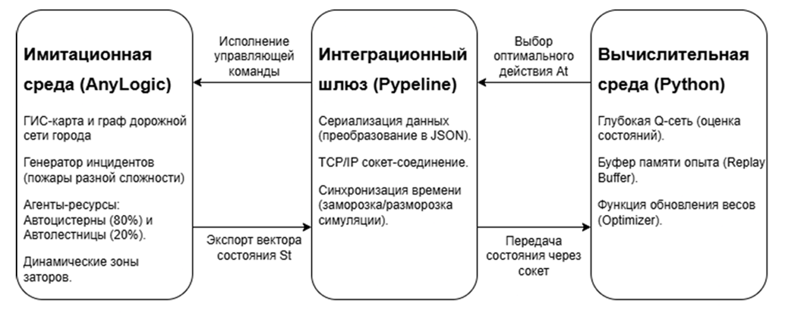
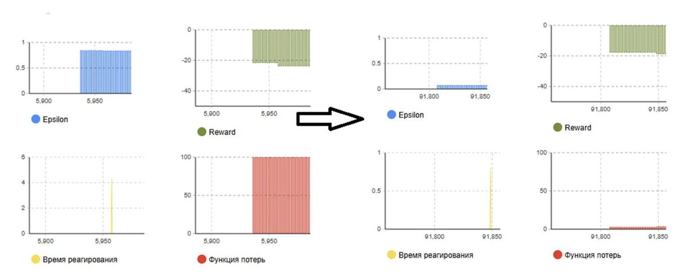

# 🚒 СППР маршрутизации гетерогенного пожарного автопарка на базе Deep Q-Network (DQN)

Интеллектуальная система поддержки принятия решений (СППР) для оперативной диспетчеризации пожарно-спасательной техники в условиях стохастических городских заторов и дефицита спецтехники (автолестниц).

Проект разработан в рамках бакалаврской ВКР в **МГТУ им. Н.Э. Баумана** (Кафедра «Прикладная математика, информатика и ИВТ», 2026 г.).

---

## 📌 Ключевая проблема

Классические навигационные алгоритмы ($A^*$, Дейкстра) используют «жадную» эвристику выбора ближайшего депо. При возникновении одновременных вызовов это приводит к **«ресурсному голоду»** — дефицитные автолестницы (АЛ, ~20% парка) расходуются на простые пожары, оставляя высотные объекты без прикрытия[cite: 1, 2].

---

## 🏗 Архитектура системы

Программный комплекс построен на базе двухуровневой распределенной архитектуры с разделением симуляции и вычислительного ядра[cite: 1, 2]:



1. **Исполнительный уровень (AnyLogic / Java):** Микроскопическое агентное моделирование на реальном графе OpenStreetMap (OSM), стохастический поток Бернулли ($p \in [0.2, 0.6]$), динамические зоны заторов (`jamZone`)[cite: 1, 2].
2. **Интеграционный шлюз (Pypeline / TCP Socket):** Бестаймаутный протокол сопряжения с блокировкой виртуального времени симуляции (`pause()` / `resume()`) на время инференса нейросети[cite: 1, 2].
3. **Ядро интеллекта (Python / PyTorch):** Глубокая Q-сеть (DQN) с буфером опыта (Experience Replay) и адаптивным расчетом функции штрафов[cite: 1, 2].

---

## 🧠 Математическая модель (MDP & DQN)

Задача формализована как Марковский процесс принятия решений[cite: 1, 2]:
* **Вектор состояния ($S_t$):** Ранг инцидента (`severity`), евклидовы расстояния до всех 4 депо (`distances`), текущий матричный остаток свободных автоцистерн (АЦ) и автолестниц (АЛ) по каждой базе (`station_status`)[cite: 1, 2].
* **Пространство действий ($A_t$):** Дискретный выбор целевой пожарной части для высылки расчета[cite: 1, 2].
* **Функция награды ($R$):** $R = -T_{\text{пути}} \times 10$, штрафующая агента за задержки в пути и мотивирующая стратегически резервировать редкую спецтехнику[cite: 1, 2].
* **Нейросеть:** Полносвязный перцептрон (MLP) $Input \to 64 \to 64 \to Output$ с активацией ReLU, оптимизатором Adam ($\alpha = 0.001$) и функцией потерь MSE[cite: 1, 2].

---

## 🖥 Пользовательские интерфейсы (HMI)

Для взаимодействия с системой спроектированы два специализированных интерфейса[cite: 1, 2]:

### 1. Рабочее место оперативного диспетчера
Динамическая ГИС-карта с отображением маршрутов в реальном времени, мониторинг доступных ресурсов депо и рекомендательная ИИ-панель с поддержкой ручного перехвата управления (Human-in-the-Loop)[cite: 1, 2]:


### 2. Панель системного администратора
Управление стресс-сценариями (интенсивность потока пожаров, загруженность дорог, скорость движения), мониторинг сходимости обучения и сохранение/загрузка весовых коэффициентов нейросети[cite: 1, 2]:


---

## 📊 Результаты экспериментов и сходимость модели

### Сходимость обучения DQN
Стабильное падение функции потерь (Loss), падение фактора исследования ($\varepsilon$-greedy) и выход средней награды (Reward) на плато подтверждают устойчивость алгоритма[cite: 1, 2]:



### Сравнительный анализ (A/B тестирование, $N = 6000$)[cite: 1, 2]

Сравнение базового «жадного» алгоритма и обученного DQN-агента при строго одинаковых начальных условиях (`seed = 1`)[cite: 1, 2]:

| Сценарий нагрузки | Алгоритм | Мат. ожидание $M[T]$, мин | Медиана $Me$, мин | Дисперсия $D[T]$ | Нарушение регламента ФЗ №123 (> 10 мин) |
| :--- | :--- | :---: | :---: | :---: | :---: |
| **Штатный режим** ($p=0.2, k=4$)[cite: 1, 2] | Базовый[cite: 1, 2] | 6.27[cite: 1, 2] | 3.99[cite: 2] | 22.89[cite: 2] | 26.26%[cite: 2] |
| | **СППР (DQN)**[cite: 1, 2] | **3.08** ($-50.9\%$)[cite: 1, 2] | **2.62**[cite: 2] | **2.36**[cite: 2] | **1.51%**[cite: 1, 2] |
| **Пиковая нагрузка** ($p=0.6, k=8$)[cite: 1, 2] | Базовый[cite: 1, 2] | 12.68[cite: 1, 2] | 7.25[cite: 2] | 117.60[cite: 2] | 40.44%[cite: 1, 2] |
| | **СППР (DQN)**[cite: 1, 2] | **4.82** ($-61.9\%$)[cite: 1, 2] | **4.41**[cite: 2] | **11.95**[cite: 2] | **3.70%**[cite: 1, 2] |

---

## 💻 Стек технологий

* **Simulation & GIS:** AnyLogic, OpenStreetMap (OSM), Java[cite: 1, 2]
* **AI / Deep Learning:** Python, PyTorch, NumPy[cite: 2]
* **Inter-Process Communication:** Pypeline (TCP/IP Sockets, JSON)[cite: 1, 2]
* **Optimization & Math:** Markov Decision Processes (MDP), Deep Q-Networks (DQN)[cite: 1, 2]

---

## 🚀 Быстрый старт

1. Склонируйте репозиторий:
   ```bash
   git clone [https://github.com/miradimo/fire-dispatch-drl.git](https://github.com/miradimo/fire-dispatch-drl.git)
   cd fire-dispatch-drl

2. Установите Python-зависимости:
    ```
    pip install -r requirements.txt
    ```
3. Откройте проект MCHS.alp в среде AnyLogic.

4. Убедитесь, что в свойствах компонента Pypeline указан путь к вашему интерпретатору Python.

5. Запустите симуляцию. Скрипт python/agent.py подключится автоматически.

## 👤 Автор
Нистратов Радимир Алексеевич

Выпускник МГТУ им. Н.Э. Баумана (ИВТ, 2026)

Telegram: [@daamnqt]

Email: [nistratov7@gmail.com]